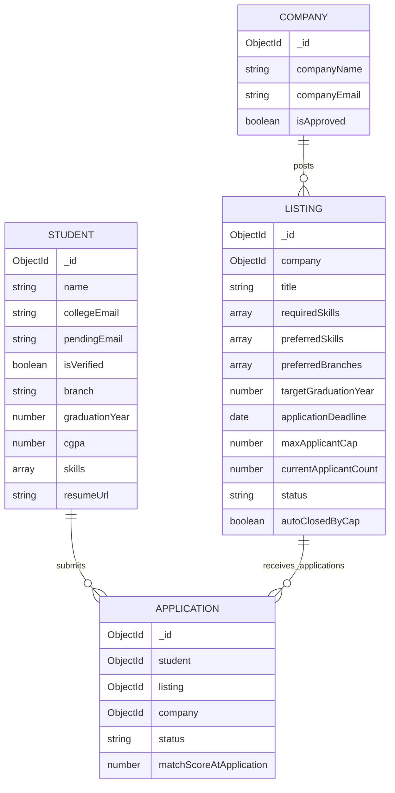
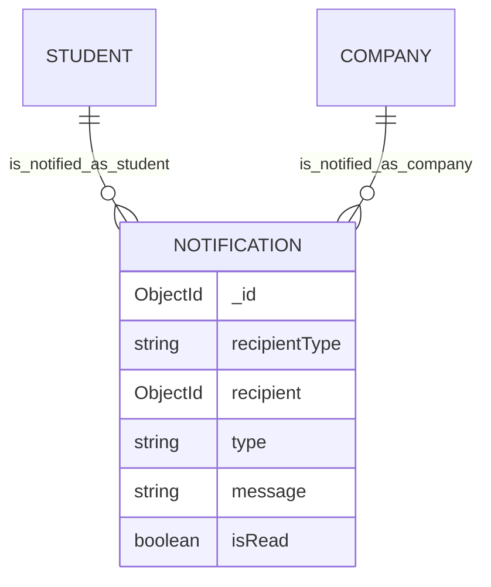

# Database Schema (ERD)

## Visual diagram

### Core entities



### Notification relationships (kept separate to avoid line crossing above)

`NOTIFICATION.recipient` is polymorphic — a Student OR a Company per row, via
Mongoose's `refPath` — so it has one relationship to each, shown here on its own:



## Field-level detail (text form)

```
Student                          Company
--------                         --------
_id                              _id
name                             companyName
collegeEmail (unique)            companyEmail (unique)
passwordHash                     passwordHash
pendingEmail                     isApproved
isVerified                       description
otpHash / otpExpiresAt           website
college                          refreshTokenHash
branch                           createdAt / updatedAt
graduationYear                          |
cgpa                                    | 1
skills[]                                |
githubUrl / linkedinUrl                 v
bio / resumeUrl                  Listing
refreshTokenHash                 --------
createdAt / updatedAt            _id
   |                             company (ref -> Company)  [indexed]
   | 1                           title / description
   |                             requiredSkills[] / preferredSkills[]  [indexed]
   |                             preferredBranches[] / targetGraduationYear
   |                             stipend / location
   |                             applicationDeadline
   |                             maxApplicantCap / currentApplicantCount
   |                             status (Draft|Active|Closed)  [indexed w/ deadline]
   |                             autoClosedByCap
   |                             createdAt / updatedAt
   |                                    |
   | many                              | many
   v                                   v
        Application
        --------------------------------
        _id
        student (ref -> Student)  [indexed]
        listing (ref -> Listing)  [indexed]
        company (ref -> Company)  [indexed, denormalized for fast auth checks]
        status (Submitted|Under Review|Shortlisted|Rejected|Offer Extended|Withdrawn)
        matchScoreAtApplication
        createdAt / updatedAt
        UNIQUE INDEX (student, listing)  <- prevents duplicate applications

Notification
--------------------------------
_id
recipientType (Student|Company)
recipient (ref -> Student|Company via refPath)  [indexed]
type (APPLICATION_STATUS_CHANGED|NEW_MATCH|NEW_APPLICANT|LISTING_AUTO_CLOSED)
message
isRead  [indexed]
createdAt / updatedAt
```

## Notes on relationships

- `Company 1 -- N Listing`, `Listing 1 -- N Application`, `Student 1 -- N Application`.
  `Application.company` is denormalized from `Listing.company` purely so
  `updateApplicationStatus` can authorize a company's action with a single lookup
  instead of a populate + join on every request.
- `Notification.recipient` uses Mongoose's `refPath` so one collection serves both
  actor types instead of two near-identical notification tables.
- Admin extensibility: `Company.isApproved` already exists as a field with no route
  to change it except the seed script — adding `PATCH /admin/companies/:id/approve`
  later requires no schema migration, only a new route + controller.
